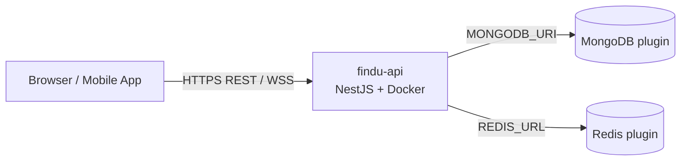

# Hướng dẫn deploy StrangerConfide Backend lên Railway

Tài liệu mô tả quy trình deploy thực tế đã thực hiện cho project **findu-backend**, gồm kiến trúc trên Railway, từng lệnh CLI, biến môi trường, thay đổi code liên quan, xử lý sự cố và checklist sau deploy.

---

## Mục lục

1. [Tổng quan](#1-tổng-quan)
2. [Kiến trúc trên Railway](#2-kiến-trúc-trên-railway)
3. [Yêu cầu trước khi deploy](#3-yêu-cầu-trước-khi-deploy)
4. [Cấu hình trong repository](#4-cấu-hình-trong-repository)
5. [Deploy lần đầu (từng bước)](#5-deploy-lần-đầu-từng-bước)
6. [Biến môi trường](#6-biến-môi-trường)
7. [Thay đổi code phục vụ production](#7-thay-đổi-code-phục-vụ-production)
8. [Deploy lại và vận hành](#8-deploy-lại-và-vận-hành)
9. [Sau deploy: cấu hình OAuth, CORS, frontend](#9-sau-deploy-cấu-hình-oauth-cors-frontend)
10. [Giới hạn và lưu ý production](#10-giới-hạn-và-lưu-ý-production)
11. [Xử lý sự cố (troubleshooting)](#11-xử-lý-sự-cố-troubleshooting)
12. [Deploy qua GitHub (tùy chọn)](#12-deploy-qua-github-tùy-chọn)
13. [Test Docker local trước khi push](#13-test-docker-local-trước-khi-push)

---

## 1. Tổng quan

| Hạng mục | Giá trị (sau deploy) |
|----------|----------------------|
| Nền tảng | [Railway](https://railway.com) |
| Project | `findu-backend` |
| Service API | `findu-api` |
| URL công khai | `https://findu-api-production.up.railway.app` |
| API base path | `/api` (global prefix NestJS) |
| Swagger | `/api/docs` |
| OpenAPI JSON | `/api/docs-json` |
| Build | Docker multi-stage (`Dockerfile`) |
| Runtime | Node 20 Alpine, `node dist/main` |

Railway tự gán biến `PORT` (ví dụ `8080`). Ứng dụng đọc `PORT` qua `ConfigService` — **không hardcode** port trong production.

---

## 2. Kiến trúc trên Railway



Trong project **findu-backend** có **3 service**:

| Service | Vai trò |
|---------|---------|
| **findu-api** | Backend NestJS (REST, Swagger, Socket.IO) |
| **MongoDB** | Database chính (Mongoose) |
| **Redis** | Pub/sub cho Socket.IO adapter + matchmaking queue |

Các service trong cùng project Railway giao tiếp qua **private network** (`*.railway.internal`). URL dạng `mongodb.railway.internal` / `redis.railway.internal` chỉ resolve **bên trong** mạng Railway — không dùng được từ máy local (trừ khi dùng `MONGO_PUBLIC_URL` / TCP proxy để debug).

---

## 3. Yêu cầu trước khi deploy

### 3.1. Tài khoản và CLI

1. Tạo tài khoản Railway và workspace.
2. Cài [Railway CLI](https://docs.railway.com/guides/cli):

   ```bash
   # macOS (Homebrew)
   brew install railway

   # Hoặc npm global
   npm i -g @railway/cli
   ```

3. Đăng nhập:

   ```bash
   railway login
   railway whoami
   ```

### 3.2. Giới hạn gói Free

- Mỗi project tiêu tố **tài nguyên** (RAM/CPU/volume). Nếu thấy lỗi *"Free plan resource provision limit exceeded"*, cần xóa project/service không dùng hoặc nâng gói.
- **3 service** (API + Mongo + Redis) là cấu hình tối thiểu cho app hiện tại; cân nhắc MongoDB Atlas + Upstash Redis bên ngoài nếu muốn giảm service trên Railway.

### 3.3. Code sẵn sàng build

```bash
cd /path/to/findu-backend
npm ci
npm run build
```

---

## 4. Cấu hình trong repository

### 4.1. `Dockerfile` (multi-stage)

| Stage | Mục đích |
|-------|----------|
| **builder** | `npm ci` + `npm run build` → thư mục `dist/` |
| **production** | Chỉ `npm ci --omit=dev` + copy `dist/` — image nhỏ, không chứa devDependencies |

Container chạy: `node dist/main` với `NODE_ENV=production`.

### 4.2. `railway.toml`

```toml
[build]
builder = "DOCKERFILE"
dockerfilePath = "Dockerfile"

[deploy]
healthcheckPath = "/api/docs"
healthcheckTimeout = 120
restartPolicyType = "ON_FAILURE"
restartPolicyMaxRetries = 3
```

- **healthcheckPath**: Railway gọi `GET /api/docs` sau khi container start. Nếu app crash (OAuth, Mongo, v.v.) → healthcheck fail → deploy **FAILED**.
- **healthcheckTimeout**: 120 giây — đủ cho Nest kết nối Mongo/Redis lần đầu.

### 4.3. `.dockerignore`

Loại trừ `node_modules`, `.env`, `uploads`, `test`, … để upload/build nhanh và **không đưa secret** vào image.

### 4.4. `.env.example`

Mẫu biến cho local; trên Railway cấu hình qua **Variables** (dashboard hoặc CLI). Không commit file `.env` thật.

---

## 5. Deploy lần đầu (từng bước)

### Bước 1: Tạo hoặc liên kết project

**Tạo project mới:**

```bash
cd /path/to/findu-backend
railway init -n findu-backend
```

**Hoặc liên kết project đã có** (lấy ID từ dashboard hoặc `railway list --json`):

```bash
railway link -p <PROJECT_ID>
# Ví dụ project đã dùng:
# railway link -p 410e5975-0598-4920-9a10-015e73c2bd72
```

Kiểm tra:

```bash
railway status
```

### Bước 2: Thêm MongoDB và Redis

```bash
railway add --database mongo
railway add --database redis
```

Railway tạo service tên mặc định **MongoDB** và **Redis**, đồng thời provision volume/credentials.

Xem biến do plugin cung cấp (tên service phải khớp khi dùng reference):

```bash
railway variable list --service MongoDB --kv
railway variable list --service Redis --kv
```

Thường gặp:

| Service | Biến quan trọng |
|---------|-----------------|
| MongoDB | `MONGO_URL`, `MONGO_PUBLIC_URL`, `MONGOUSER`, `MONGOPASSWORD` |
| Redis | `REDIS_URL`, `REDIS_HOST`, `REDIS_PASSWORD` |

### Bước 3: Tạo service cho API

```bash
railway add --service findu-api
railway link -p <PROJECT_ID> -s findu-api
```

Mọi lệnh `railway up` / `railway variable` sau này mặc định áp dụng cho service **đang link** (`findu-api`).

### Bước 4: Gán biến môi trường

**Cách khuyến nghị — reference giữa service** (tự cập nhật khi Railway rotate credential):

Trên dashboard: **findu-api → Variables → RAW Editor**, hoặc CLI:

```bash
railway variable set \
  NODE_ENV=production \
  'MONGODB_URI=${{MongoDB.MONGO_URL}}' \
  'REDIS_URL=${{Redis.REDIS_URL}}' \
  --skip-deploys
```

> **Lưu ý tên service**: Reference dùng đúng tên hiển thị trên dashboard (ví dụ `MongoDB`, `Redis`). Sai tên → biến resolve rỗng → app lỗi.

**JWT** — tạo secret mạnh (không dùng giá trị dev):

```bash
JWT_SECRET=$(openssl rand -base64 48 | tr -d '\n' | head -c 64)
JWT_REFRESH_SECRET=$(openssl rand -base64 48 | tr -d '\n' | head -c 64)

railway variable set \
  "JWT_SECRET=$JWT_SECRET" \
  "JWT_REFRESH_SECRET=$JWT_REFRESH_SECRET" \
  JWT_EXPIRES_IN=7d \
  JWT_REFRESH_EXPIRES_IN=30d \
  --skip-deploys
```

**Google OAuth** (từ `.env` local, không in ra terminal khi có thể):

```bash
GOOGLE_CLIENT_ID=$(grep '^GOOGLE_CLIENT_ID=' .env | cut -d= -f2-)
GOOGLE_CLIENT_SECRET=$(grep '^GOOGLE_CLIENT_SECRET=' .env | cut -d= -f2-)

railway variable set \
  "GOOGLE_CLIENT_ID=$GOOGLE_CLIENT_ID" \
  "GOOGLE_CLIENT_SECRET=$GOOGLE_CLIENT_SECRET" \
  --skip-deploys
```

**Callback URL** — set **sau khi** có domain (bước 6):

```bash
railway domain
# → https://findu-api-production.up.railway.app

railway variable set \
  "GOOGLE_CALLBACK_URL=https://findu-api-production.up.railway.app/api/auth/google/callback" \
  "FRONTEND_URL=https://your-frontend-domain.com" \
  --skip-deploys
```

**Không set biến rỗng qua CLI:**

```bash
# ❌ Railway CLI từ chối
railway variable set CORS_ORIGINS=

# ✅ Bỏ qua hoặc set giá trị thật
railway variable set CORS_ORIGINS=https://app.example.com,https://www.example.com
```

`--skip-deploys`: chỉ ghi biến, chưa trigger build — tiện khi set nhiều biến một lúc.

### Bước 5: Bật domain công khai

```bash
railway domain
```

Hoặc: **Service findu-api → Settings → Networking → Generate Domain**.

### Bước 6: Deploy

```bash
railway up --detach
```

- `railway up`: upload source + build theo `Dockerfile` / `railway.toml`.
- `--detach`: không treo terminal; xem log qua dashboard hoặc `railway logs`.

Theo dõi deployment:

```bash
railway deployment list --json
railway logs --lines 100
```

Build logs trên web: link in ra sau khi `railway up` (dạng `railway.com/project/.../service/...`).

### Bước 7: Xác minh

```bash
curl -s -o /dev/null -w "%{http_code}\n" \
  https://findu-api-production.up.railway.app/api/docs

curl -s https://findu-api-production.up.railway.app/api/docs-json | head -c 300
```

Kỳ vọng HTTP `200` và body OpenAPI JSON.

---

## 6. Biến môi trường

### 6.1. Bắt buộc cho findu-api

| Biến | Mô tả | Gợi ý Railway |
|------|--------|----------------|
| `NODE_ENV` | `production` | Set thủ công |
| `PORT` | Port HTTP | **Tự động** bởi Railway |
| `MONGODB_URI` hoặc `MONGO_URL` | Mongo connection | `${{MongoDB.MONGO_URL}}` + xử lý DB trong code |
| `REDIS_URL` | Redis connection | `${{Redis.REDIS_URL}}` |
| `JWT_SECRET` | Ký access token | Random 64+ ký tự |
| `JWT_REFRESH_SECRET` | Ký refresh token | Random, khác `JWT_SECRET` |
| `GOOGLE_CLIENT_ID` | Google OAuth / mobile | Từ Google Cloud Console |
| `GOOGLE_CLIENT_SECRET` | Google OAuth web flow | Console |
| `GOOGLE_CALLBACK_URL` | Redirect OAuth web | `https://<domain>/api/auth/google/callback` |
| `FRONTEND_URL` | Origin chính cho CORS production | URL frontend thật |

### 6.2. Tùy chọn

| Biến | Mô tả |
|------|--------|
| `MONGODB_DB` | Tên database (mặc định `strangerconfide`) |
| `CORS_ORIGINS` | Thêm origin, phân tách bằng dấu phẩy |
| `JWT_EXPIRES_IN` | Mặc định `15m` trong code JWT module |
| `JWT_REFRESH_EXPIRES_IN` | Mặc định `30d` |
| `FACEBOOK_APP_ID` / `SECRET` / `CALLBACK_URL` | Chỉ khi bật Facebook OAuth (khác `placeholder`) |
| `MAIL_*` | SMTP gửi OTP |
| `MAX_FILE_SIZE_MB` | Giới hạn upload |
| `ALLOW_OTP_BYPASS` | `true` chỉ nên dùng tạm — **không** bật production |

### 6.3. Reference giữa service (Railway)

Cú pháp:

```text
${{TênService.TÊN_BIẾN}}
```

Ví dụ trong RAW editor:

```env
MONGODB_URI=${{MongoDB.MONGO_URL}}
REDIS_URL=${{Redis.REDIS_URL}}
```

Code `resolveMongoUri()` sẽ:

1. Thêm tên DB `strangerconfide` nếu URI chưa có path database.
2. Thêm `authSource=admin` nếu chưa có — **bắt buộc** với user root của Mongo image trên Railway.

---

## 7. Thay đổi code phục vụ production

### 7.1. Listen `0.0.0.0` — `src/main.ts`

Trong container, process phải bind mọi interface, không chỉ `localhost`:

```typescript
await app.listen(port, '0.0.0.0');
```

### 7.2. OAuth tùy chọn — `src/modules/auth/oauth.util.ts`

**Vấn đề gặp phải khi deploy:** `FacebookStrategy` khởi tạo với `clientID` undefined → crash ngay khi boot → healthcheck fail.

**Giải pháp:** Chỉ đăng ký `GoogleStrategy` / `FacebookStrategy` khi `clientID` có giá trị và **không** phải `placeholder` / `changeme`.

Route `/api/auth/facebook` vẫn tồn tại nhưng sẽ lỗi runtime nếu strategy chưa load — chấp nhận được khi chưa cấu hình Facebook.

### 7.3. MongoDB URI — `src/config/mongodb.util.ts`

**Vấn đề:** `Authentication failed` khi nối Mongo Railway dù user/password đúng — thiếu `authSource=admin`.

**Giải pháp:** `resolveMongoUri()` trong `app.module.ts` chuẩn hóa URI trước khi Mongoose connect.

### 7.4. CORS — `src/config/cors.util.ts`

| Môi trường | Hành vi |
|------------|---------|
| `NODE_ENV=production` | Chỉ `FRONTEND_URL` + `CORS_ORIGINS` |
| Development | Thêm localhost và ngrok |

Sau deploy phải cập nhật `FRONTEND_URL` khỏi URL ngrok dev.

### 7.5. Socket.IO + Redis — `src/common/adapters/socket-io.adapter.ts`

Ưu tiên `REDIS_URL`; fallback `REDIS_HOST` / `REDIS_PORT` / `REDIS_PASSWORD`. Trên Railway nên dùng `REDIS_URL` từ plugin.

---

## 8. Deploy lại và vận hành

### Deploy thủ công (CLI)

```bash
railway link -p <PROJECT_ID> -s findu-api   # nếu chưa link
railway up --detach -m "fix: mô tả ngắn"
```

### Xem log / deployment

```bash
railway logs
railway logs --deployment <DEPLOYMENT_ID> --lines 200
railway deployment list --json
```

### Quản lý biến

```bash
railway variable list --kv
railway variable set KEY=value
railway variable delete KEY
```

### Mở dashboard

```bash
railway open
```

### Rollback

Dashboard → **Deployments** → chọn bản **SUCCESS** trước đó → **Redeploy**.

---

## 9. Sau deploy: cấu hình OAuth, CORS, frontend

### 9.1. Google Cloud Console

1. **APIs & Services → Credentials** → OAuth 2.0 Client.
2. **Authorized redirect URIs** thêm:
   - `https://findu-api-production.up.railway.app/api/auth/google/callback`
3. Nếu dùng Google Sign-In mobile: giữ `GOOGLE_CLIENT_ID` trùng client Android/iOS/Web.

### 9.2. Facebook (khi cần)

1. Set `FACEBOOK_APP_ID`, `FACEBOOK_APP_SECRET`, `FACEBOOK_CALLBACK_URL` trên Railway.
2. Valid OAuth Redirect URI trùng callback.

### 9.3. Frontend / mobile

```env
NEXT_PUBLIC_API_URL=https://findu-api-production.up.railway.app/api
NEXT_PUBLIC_BACKEND_URL=https://findu-api-production.up.railway.app
```

Socket.IO client kết nối cùng origin backend (WSS), đảm bảo CORS/credentials khớp `cors.util.ts`.

### 9.4. Kiểm tra CORS nhanh

```bash
curl -s -D - -o /dev/null \
  -H "Origin: https://your-frontend.com" \
  https://findu-api-production.up.railway.app/api/docs
```

Tìm header `Access-Control-Allow-Origin` trong response (với route có bật CORS).

---

## 10. Giới hạn và lưu ý production

### 10.1. Upload file (`uploads/`)

`main.ts` phục vụ static từ `uploads/` trên **filesystem local**. Trên Railway filesystem **ephemeral** — redeploy hoặc restart có thể **mất file**.

Hướng xử lý dài hạn:

- Object storage (S3, Cloudflare R2, …), hoặc
- [Railway Volume](https://docs.railway.com/guides/volumes) mount vào `/app/uploads`.

### 10.2. Swagger trên production

`/api/docs` đang public — tiện debug nhưng lộ API surface. Cân nhắc tắt hoặc bảo vệ bằng auth/IP khi lên production thật.

### 10.3. Healthcheck

Đang trỏ `/api/docs`. Nếu tắt Swagger, đổi trong `railway.toml` sang endpoint nhẹ, ví dụ:

```toml
healthcheckPath = "/api/docs-json"
```

(hoặc thêm route `/health` chuyên dụng).

### 10.4. Bảo mật secret

- Không commit `.env`.
- JWT production phải khác dev.
- Rotate secret nếu từng lộ qua log/chat.

---

## 11. Xử lý sự cố (troubleshooting)

### Deploy FAILED — healthcheck `/api/docs` unavailable

| Triệu chứng log | Nguyên nhân | Cách xử lý |
|-----------------|-------------|------------|
| `OAuth2Strategy requires a clientID` | Facebook/Google strategy boot không có ID | Đã fix bằng `oauth.util.ts`; hoặc set `FACEBOOK_APP_ID=placeholder` tạm |
| `Authentication failed` (Mongo) | Sai URI / thiếu `authSource` | Dùng `${{MongoDB.MONGO_URL}}`; code `resolveMongoUri` |
| `MONGODB_URI hoặc MONGO_URL phải được cấu hình` | Chưa set biến | Set reference hoặc URL đầy đủ |
| Redis connection error | Redis chưa provision / sai `REDIS_URL` | `railway variable list --service Redis` |
| Build OK, runtime crash loop | Xem `railway logs --deployment <id>` | Sửa env/code → `railway up` |

### CLI: `Failed to fetch ... backboard.railway.com ... timed out`

API Railway không ổn định tạm thời. Thử lại sau vài phút hoặc set biến trên **dashboard**. Deploy (`railway up`) đôi khi vẫn chạy khi `variable set` timeout.

### CLI: `Invalid variable format: CORS_ORIGINS=`

Không gửi giá trị rỗng. Xóa biến trên dashboard hoặc set danh sách origin thật.

### CLI: `Free plan resource provision limit exceeded`

Xóa project/service cũ (`railway list`) hoặc nâng gói; gộp DB/Redis bên ngoài để giảm số service.

### CORS vẫn chặn frontend

1. `FRONTEND_URL` đúng scheme + host (không thừa slash).
2. `NODE_ENV=production`.
3. Thêm origin phụ vào `CORS_ORIGINS`.

### Google OAuth redirect mismatch

`GOOGLE_CALLBACK_URL` trên Railway **khớp từng ký tự** với URI trong Google Console (https, path `/api/auth/google/callback`).

---

## 12. Deploy qua GitHub (tùy chọn)

Thay vì `railway up` từ máy local:

1. Push repo lên GitHub.
2. Railway → **New Project** → **Deploy from GitHub repo**.
3. Chọn repo, service **findu-api**, root directory `/`.
4. Railway build từ `Dockerfile` + `railway.toml` mỗi lần push branch đã cấu hình.
5. Biến môi trường vẫn cấu hình trên dashboard (shared environment).

Lợi ích: CI tự động, không cần CLI trên máy dev.

---

## 13. Test Docker local trước khi push

```bash
docker build -t findu-api:local .
docker run --rm -p 3000:3000 \
  -e NODE_ENV=production \
  -e PORT=3000 \
  -e MONGODB_URI="mongodb://host.docker.internal:27017/strangerconfide" \
  -e REDIS_URL="redis://host.docker.internal:6379" \
  -e JWT_SECRET=local-test-secret \
  -e JWT_REFRESH_SECRET=local-test-refresh \
  findu-api:local
```

Mở http://localhost:3000/api/docs — mô phỏng gần giống container Railway (vẫn cần Mongo/Redis chạy local hoặc tunnel).

---

## Phụ lục: Lệnh tham chiếu nhanh

```bash
# Auth & project
railway login
railway whoami
railway list
railway link -p <PROJECT_ID> -s findu-api
railway status

# Hạ tầng
railway add --database mongo
railway add --database redis
railway add --service findu-api
railway domain

# Deploy & ops
railway up --detach
railway logs --lines 100
railway deployment list --json
railway variable list --kv
railway variable set KEY=value --skip-deploys
railway open
```

---

## Liên kết

- [Railway Docs — Deployments](https://docs.railway.com/guides/deployments)
- [Railway Docs — Variables](https://docs.railway.com/guides/variables)
- [Railway Docs — Dockerfiles](https://docs.railway.com/guides/dockerfiles)
- File mẫu env: [`.env.example`](../.env.example)
- Cấu hình deploy: [`railway.toml`](../railway.toml)

*Tài liệu phản ánh deploy thực tế project findu-backend (tháng 6/2026). Cập nhật domain/ID project trên dashboard nếu bạn tạo project mới.*
